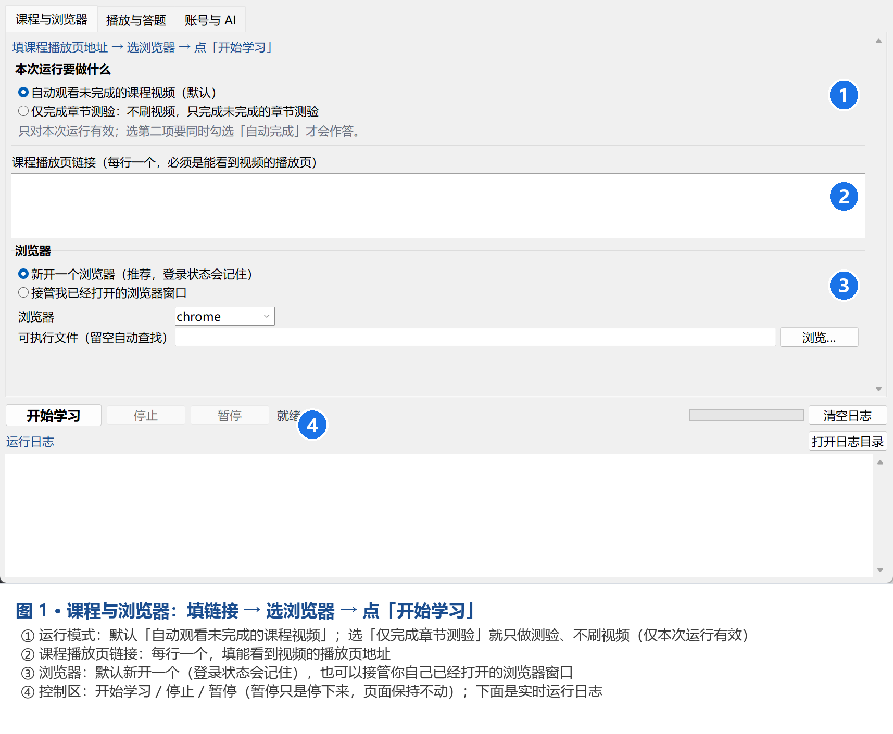
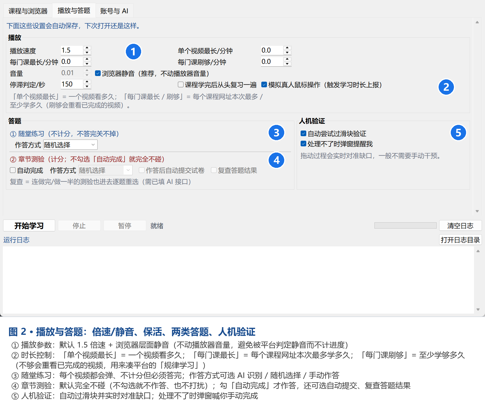
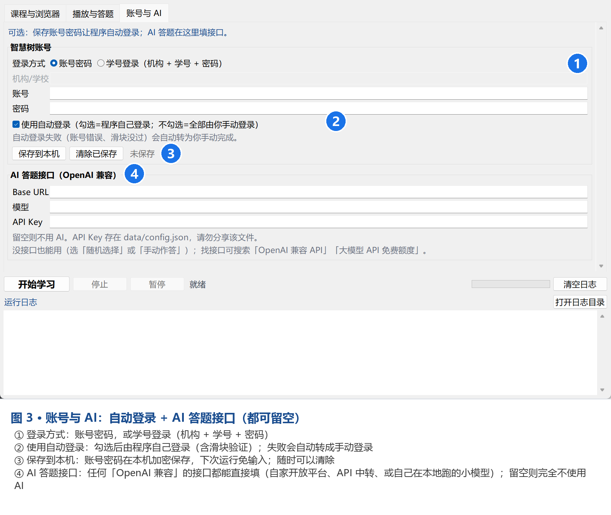

# 智慧树杀手（ZhiHuiShu_Killer）

一个带图形界面的智慧树网课自动化工具。基于 Python + Playwright，
用真实浏览器模拟操作，自动播放未完成的课程视频。

## 快速开始

1. 安装 [Python 3.10+](https://www.python.org/downloads/)（安装时勾选 *Add to PATH*）
   和 Google Chrome（或 Edge）
2. 在本目录执行一次：`python -m pip install -r requirements.txt`
3. 双击 `run.bat` 启动

首次运行会在本目录自动生成 `data/`（配置、日志、浏览器数据都在里面）。

> ⚠️ **使用前请先阅读**：本工具会代替你完成网课观看过程。使用自动化脚本可能违反
> 智慧树平台的使用条款以及你所在学校的学术诚信规定，账号也存在被风控/封禁的风险。
> 请自行评估后果，仅在你能承担的范围内使用。

---

## 一、功能

**课程**

- **暂停 / 继续**：开始后会启用一个「暂停」按钮。暂停只是让自动化停下来，
  浏览器页面保持不变；点「继续」会接着之前的工作往下做。
  （「停止」是结束本轮运行，两者不同。）
- 按课程播放页地址逐门学习，自动定位目录里**未完成**的课时并依次播放
- **两种运行模式**（界面「课程与浏览器」页顶部选择）：
  - **自动观看未完成的课程视频**（默认）
  - **仅完成章节测验**：不刷视频，只找出目录里未完成的章节测验并完成
    （适合"先把所有视频刷完、最后再统一做章节测验"的用法；
    需要同时在「播放与答题」里勾选「自动完成章节测验」）
    - **只对本次运行有效**：下次打开程序会回到默认的刷课模式，不会记住这个选择
- 自动切换到下一个未完成课时；整门课学完后自动进入下一门课程
- 完成判据用**平台记录的进度**（目录里的进度环/对勾），因此
  「视频没播完但进度已记满」和「视频播完了进度还差一点」两种情况都能正确处理
  - 进度已记满 → 立即切下一课时
  - 视频播完但进度没记满 → 回退到平台记录位置重播，最多重试 2 次

**播放器**

- **静音默认走浏览器层面**（启动参数 `--mute-audio`）：整个浏览器不出声，
  但**完全不改动播放器的音量** —— 页面看到的还是站点自己设的值，
  这样就彻底避开了"音量=0 被平台判定为静音、不计进度"的风险
  - 如果取消勾选「在浏览器层面静音」，才会退回去改 `video.volume`（可填 0.01 等）
- 倍速默认 **1.5**，可调；站点若改回去会自动重新设置
- 页面被遮罩挡住时先暂停视频，处理完弹窗再续播

**弹窗与验证**

- **随堂练习**（每个视频都会弹、对错不计分、不答完关不掉）：程序会**自动选一个选项并提交，
   再关掉解析弹窗**。作答方式可选 随机 / AI 识别 / 手动作答。
   一次弹窗里有多道题时会逐题作答再统一提交。
- **章节测验（章节练习 / 章节测试）**：这是**计分内容，默认完全不动**。
  不勾选时程序**绝不碰它，也不会弹窗打扰**，只在日志里写一行「已跳过」。
  - 勾选「自动完成章节测验」后才会自动作答；作答方式可选随机 / AI
  - 章节测验有两种形态，程序都会处理：**整页试卷**（在线考试页，一页一题，
    靠「下一题」翻页）和**弹窗**。题型覆盖 单选题 / 多选题 / 判断题
    （多选题交给 AI 一次给出多个字母；AI 不可用时随机选 2 项）
  - 智慧树把**题干渲染在 closed shadow root 里**（普通 DOM 读不到），
    程序改用**浏览器的无障碍树**读取题干，所以 AI 能看到完整题目
  - 另有独立开关「作答完成后自动提交试卷」：不勾选时程序只作答、
    最后点一次「**保存**」（即最后一题位置的按钮）把全部答案存到服务器，
    然后**保留这个答题标签页**并在右下角提醒你核对后自己提交；
    勾选则作答完点「提交作业」自动交卷
    - 注意：不能用左上角的「暂存作业」——它会弹确认框、确认后还会**关掉标签页**
  - **答题卡加速**：试卷右侧答题卡带完成率与每题状态，程序只跳去未作答的题；
    完成率 100% 的测验直接略过，不再从第一题一题一题翻
  - 新增开关「**复查答题结果**」（需已填 AI 接口）：勾选后连完成率 100%
    或做到一半的测验也会进去**逐题重选**，再按「自动提交」开关决定是否交卷
  - **同一条测验失败会原地重试**（最多 3 次）：章节列表被收起、点不动，
    或者试卷页弹「网络异常」打不开，都会收拾干净后重试这一条，
    不会再"从第四章直接跳到第六章"
  - 点击后**毫无反应**时，会先把挡在前面的弹层（随堂练习等）清掉再重点一次，
    最多 3 次，不会因为一次遮挡就把这一章跳过
  - 三轮都点不开（这类测验通常要求先看完对应章节的视频）才跳过并在日志里说明，
    不会反复空转；下次运行会自动再试
  - 仅章节测验模式下会**让页面视频保持暂停**（持续压制站点自己的自动续播，
    播放器在 iframe 里也会被按住），所以不会再弹出随堂练习把章节列表顶掉；
    万一还是弹了，会先把它答掉关掉，绝不会把随堂练习当成章节测验去作答
  - 侧边栏被**手动收起**时也能自动展开（`hide-box` 是加在外层 `<aside>` 上的，
    程序会顺着父节点找）
  - 注意：随堂练习和章节测验是**两套完全独立的设置**，界面里已分开成两块
- **人机验证（网易易盾滑块）**：自动识别缺口位置，按下后**实时回读拼图块位置**
  （会等过渡动画停稳再读数），按实测比例把拼图块送到缺口上、松手前再微调，
  然后才提交；拖动过程用 CDP 直发鼠标事件，避免浏览器丢 mousemove 导致
  "每次都差一截"。识别失败或未开启自动时，弹窗提醒你手动完成，程序暂停等待
- **AI 作答失败不会立刻改随机**：每道题最多连着重试 **5 次**（中间有短暂退避）。
  还是不行才弹窗说明可能原因（Key 失效 / 额度用完未续费 / 地址或模型填错 /
  网络超时）和最后一次错误，并让你选择：
  - 「**继续用 AI**」——刚续费或改好配置就选这个，程序会重新用它作答；
    同一次运行里只问一次，之后每题仍会自动尝试 AI，恢复正常就继续用 AI
  - 「改用随机选择」（随堂练习）/「改用手动作答」（章节测验）——选完立刻继续，
    选择会一并写入配置
  - 连续失败后 AI 会进入 **5 分钟冷却**：这段时间直接随机作答，
    过后自动再试，不会每题都干等几分钟
- **不抢你的焦点**：答题时平台新开的标签页都在后台处理，程序不再把浏览器
  窗口强行弹到最前面；只有需要你亲自动手（手动登录、人机验证）时才叫到前台
- **网络错误等提示框**：识别后自动点「确定」，并尝试恢复播放；
  试卷页的「网络异常，请稍后再试（错误代码0-979）」也会自动点掉，
  还加载不出来就自动重新加载试卷页
- **学前必读 / 学习时长 / 公告**等弹窗自动关闭
- 连续 N 秒没有任何进度变化时，自动排查验证码、弹题、错误弹窗并尝试恢复
- **模拟真人鼠标操作**：开课时以及「视频在播但平台进度不涨」时，自动做一轮真实鼠标移动
  + 顶部栏点击（Playwright 走真实输入通道），用于触发平台的学习时长上报；
  全程避开视频区域，不会误触播放/暂停

**登录**

- **使用自动登录**总开关：不勾选 = 登录全部由你手动完成（程序不碰登录流程）；
  勾选 = 程序自己登录，**自动登录失败时（账号错误、滑块没过）会自动转为你手动完成**
- 支持两种登录方式（界面「账号与 AI」页选择）：
  - **账号密码登录**
  - **学号登录**：填「机构 / 学号 / 密码」三项
- 工具菜单里有「**重置登录状态**」：点过之后，下次「开始学习」会先清空浏览器里的
  登录凭证，平台重新弹出登录页（换账号时用）
- 支持在程序内保存账号密码（Windows 上用系统凭据保护 DPAPI 加密）
- 「是否用程序内保存的账号登录」在**浏览器启动之前**就问清楚，
  不会出现"浏览器已经打开登录页了才弹询问"的互相干扰
- 第一次运行且未配置账号时，弹窗询问：**同意 / 拒绝 / 不再提醒**
  - 同意 → 立即输入账号密码，之后自动登录
  - 拒绝 → 本次手动登录，**下次运行仍会询问**
  - 不再提醒 → 以后都手动登录，不再询问
- 手动登录模式：**全程不刷新页面**。程序最多加载一次登录页，
 之后完全靠"智慧树登录成功后自己会跳走"来判断，所以微信扫码的二维码
  不会因为程序刷新而消失（智慧树对登录页有短时刷新限制）
- **判断登录状态只看页面 URL 有没有离开登录域**，不看 cookie。
  站点在未登录时也会下发 `o_session_id`、`JSESSIONID` 这类带 session 字样的
  cookie，用 cookie 判断会出现"人还在登录页，程序却认为已登录"的自作主张
  （这是修过的一个真实 bug）
- **登录成功后程序会自动继续，不需要点任何按钮**（"确定"按钮只是给你手动确认用的）
- 程序提示浮窗固定在**屏幕右下角**并且不抢焦点，不会挡住浏览器中间的二维码
- 浏览器使用独立配置目录，登录状态会保留，下次运行免登录
  （另外登录 Cookie 会额外存一份到 `data/cookies.json`，会话级 Cookie 也能扛过关闭浏览器）

**浏览器**

- 模式一：**新开一个浏览器**（独立配置目录，不与日常浏览器冲突）
- 模式二：**接管已经打开的浏览器窗口**（CDP 连接，复用你现有的登录状态）

---

## 二、界面预览

### 1. 课程与浏览器：填链接 → 选浏览器 → 点「开始学习」



- **运行模式**：默认「自动观看未完成的课程视频」；选「仅完成章节测验」就只做测验、不刷视频（仅本次运行有效）
- **课程播放页链接**：每行一个，填能看到视频的播放页地址
- **浏览器**：默认新开一个（登录状态会记住），也可以接管你自己已经打开的浏览器窗口
- **控制区**：开始学习 / 停止 / 暂停（暂停只是停下来，页面保持不动）；下面是实时运行日志

### 2. 播放与答题：倍速与静音、保活、两类答题、人机验证



- **播放参数**：默认 1.5 倍速 + 浏览器层面静音（不改播放器音量，避免被平台判定静音而不计进度）
- **时长控制**：
  - 「单个视频最长」= 一个视频最多看多久（0 = 不限制）
  - 「每门课最长」= 每个课程网址本次最多学多久（0 = 不限制，到点换下一门）
  - 「每门课刷够」= 每个课程网址本次**至少**学多久（0 = 不用；视频都看完了会**重看已完成课时**来凑时长，用来刷平台的「规律学习」评分）
- **保活**：「停滞判定」秒数内没有进度就自动排查验证码 / 弹题 / 错误弹窗；「模拟真人鼠标操作」用于触发学习时长上报
- **随堂练习**：每个视频都会弹、不计分但必须答完；作答方式可选 AI 识别 / 随机选择 / 手动作答
- **章节测验**：默认完全不碰（不勾选就不作答、也不打扰）；勾「自动完成」才作答，还可选自动提交、复查答题结果
- **人机验证**：自动过滑块并实时对准缺口；处理不了时弹窗喊你手动完成

### 3. 账号与 AI：自动登录 + AI 答题接口（都可留空）



- **登录方式**：账号密码，或学号登录（机构 + 学号 + 密码）
- **使用自动登录**：勾选后由程序自己登录（含滑块验证）；失败会自动转成手动登录
- **保存到本机**：账号密码在本机加密保存，下次运行免输入；随时可以清除
- **AI 答题接口**：任何 OpenAI 兼容接口都能直接填；留空则完全不使用 AI

> 配图用的是程序默认的空配置（没有填账号 / 接口），实际使用时填你自己的即可。

---

## 三、安装

需要 Windows 10 及以上、本机已安装 Chrome 或 Edge。

```bat
python -m venv .venv
.venv\Scripts\python.exe -m pip install -r requirements.txt
```

无需 `playwright install`：程序直接使用本机已安装的 Chrome / Edge。

## 四、运行

双击 `run.bat`，或者：

```bat
.venv\Scripts\python.exe main.py
```

## 五、使用步骤

1. 在「课程与浏览器」页填入**课程播放页**地址（能看到视频的那个页面），一行一个。
   > 注意：要填**播放页**，不是课程首页、不是课程详情页。
2. 选择浏览器模式：
   - **新开浏览器**：直接开始即可，第一次会打开登录页。
   - **接管已打开的浏览器**：先点「启动可调试浏览器」，
     在打开的窗口里登录智慧树，再把模式切到「接管」后开始。
3. 在「播放与答题」页按需要调整倍速、音量、章节练习开关等。
4. 在「账号与 AI」页可选填账号密码（点「保存到本机」）和 AI 接口。
5. 点「开始学习」。

### 第一次运行时

如果程序里没有保存账号密码，会弹出询问：

| 选择 | 效果 |
| --- | --- |
| 同意 | 立即输入账号密码并保存，之后由程序自动登录（含滑块验证） |
| 拒绝 | 本次手动登录；**下次运行还会再问一次** |
| 不再提醒 | 以后都由你手动登录，不再询问 |

手动登录时程序会弹窗，你在浏览器里登录完成后点「确定」；程序没检测到登录会再次提示。

---

## 六、配置说明

配置文件在 `data/config.json`，界面上改完点「开始学习」会自动保存。

| 字段 | 含义 |
| --- | --- |
| `courses` | 课程播放页地址列表 |
| `run_mode` | `watch` 刷课（默认） / `chapter_only` 仅完成章节测验 |
| `browser.same_tab_redirect` | 把站点的"新标签页打开"改成当前页打开（默认开，用于保住章节测验的登录态） |
| `browser.mode` | `new` 新开浏览器 / `attach` 接管已打开浏览器 |
| `browser.driver` | `chrome` / `edge` |
| `browser.cdp_url` | 接管模式的调试地址，默认 `http://127.0.0.1:9222` |
| `playback.speed` | 播放倍速，0.5–2.0 |
| `playback.mute_browser` | 是否用浏览器层面静音（默认开；开了就不动播放器音量） |
| `playback.volume` | 播放器音量（0~1），仅在浏览器静音关闭时生效，默认 0.01 |
| `diagnostics.record_events` | 排障用：记录谁在调用 video.pause()/play()（默认 false） |
| `diagnostics.capture_network` | 排障用：记录学习时长/进度上报的网络请求（默认 false） |
| `captcha.slider_offset` | 滑块对齐后再多拖几像素（默认 0，个别分辨率下才需要） |
| `playback.max_minutes_per_lesson` | 单个视频最多学多少分钟，0 表示不限 |
| `playback.max_minutes_per_course` | 每门课（每个课程网址）本次最多学多少分钟，0 表示不限 |
| `playback.min_minutes_per_course` | 每门课本次**至少**学多少分钟，0 表示不用；视频看完了会重看已完成课时来凑时长（刷「规律学习」用） |
| `playback.stall_seconds` | 多久没进度变化算卡住，默认 150 秒 |
| `playback.review_when_finished` | 全部学完后是否再复习一遍（复习时会**从头重播**，按「放完一遍」判定完成，不会因为进度已是 100% 就直接跳过） |
| `playback.simulate_activity` | 是否模拟真人鼠标操作（触发学习时长上报，默认开） |
| `quiz.auto_chapter_quiz` | 是否自动完成章节测验 |
| `quiz.auto_submit_chapter` | 章节测验作答完成后是否自动提交（默认否，交给你自己提交） |
| `quiz.review_chapter` | 是否复查章节测验（对 100%/做到一半的测验逐题重选；需 AI 可用） |
| `quiz.in_video_mode` | 随堂练习：`random` / `ai` / `manual` |
| `quiz.chapter_mode` | 章节练习：`random` / `ai` / `manual` |
| `quiz.ai.*` | OpenAI 兼容接口的 base_url / api_key / model |
| `captcha.auto_slider` | 是否自动拖滑块 |
| `captcha.notify_user` | 自动处理不了时是否弹窗提醒 |
| `captcha.slider_offset` | 对齐缺口后再多拖几像素（默认 0，个别分辨率下才需要调） |
| `login.auto_login` | 是否启用自动登录 |
| `login.prompt_state` | `ask` 每次询问 / `muted` 不再提醒 |

其它文件：

- `data/accounts.dat`：加密保存的账号密码
- `data/browser_profile/`：新开浏览器模式的独立浏览器配置（登录状态在这里）
- `data/logs/`：每次运行的日志

### AI 答题

「答题方式」选 AI 后，程序会把题干和选项发给一个 **OpenAI 兼容**的
`/chat/completions` 接口，只要求它返回选项字母。只要是「OpenAI 兼容」的接口
（各家大模型平台开放出来的接口、API 中转站、或者你自己在本地跑的小模型）都能用：
把 Base URL 填进去，模型名按对方文档里写的填，Key 填自己的即可。

**不知道怎么弄 AI 接口？** 这里不推荐具体服务商，你自己在网上搜这几个关键词就行：

| 在网上搜索 | 适合谁 |
| --- | --- |
| `OpenAI 兼容 API` | 想直接用现成接口 —— 绝大多数大模型平台都提供这种格式 |
| `大模型 API 免费额度`、`大模型 API 申请教程` | 想先免费试试 —— 不少平台有免费额度，答这些选择题完全够用 |
| `本地部署大模型 教程` | 想完全免费、离线、不用别人的 Key —— 在自己电脑上跑一个小模型，工具会自带 OpenAI 兼容接口（Base URL 通常形如 `http://127.0.0.1:11434/v1`），缺点是要有还行的显卡 / 内存 |

**不想折腾也完全没问题**：作答方式选「随机选择」或「手动作答」，程序照样能刷课、
做随堂练习和章节测验，只是选择题的正确率不如 AI。

⚠️ 两点提醒：

- 只在信得过的平台申请接口，**不要**把陌生人分享的 Key 填进来；
- `data/config.json` 里存着你的 API Key，**别把这个文件发给别人**，截图时也要遮掉。

**AI 用不了的时候**：每道题会先连着重试 5 次；还是不行才弹窗，列出可能原因
（Key 失效 / 额度用完未续费 / 地址或模型填错 / 网络超时）和最后一次错误，并让你选：

- 「**继续用 AI**」—— 刚续费或改好配置就选它，程序会重新用它作答
  （同一次运行只问一回，之后每题仍会自动尝试 AI）；
- 「改用随机选择」（随堂练习）/「改用手动作答」（章节测验）—— 立刻继续，
  这个选择会一并写进 `data/config.json`，修好 AI 后回界面改回「AI 识别」即可。

连续失败后 AI 会进入 **5 分钟冷却**，这段时间直接随机作答，过后自动再试，
不会每题都干等几分钟。

---

## 六、常见问题

**问：程序一直卡着不动？**
先看浏览器里是不是弹了人机验证或随堂练习。程序会自动排查（默认 150 秒无进度就查一次），
也可以在界面上调小 `停滞判定`。若自动处理不了，会弹窗让你手动完成。

界面本身如果卡住（按钮点不动、弹窗不出现），异常会记录到 `data/logs/ui-errors.log`，
把这个文件发出来即可定位。

`data/logs/` 里的运行日志、页面导出会自动清理：**超过 7 天**的、或者数量超过 40 个的
旧文件，在每次点「开始学习」时顺手删掉，不用手动整理。

**问：微信扫码二维码不出现 / 登录一直失败？**
智慧树对登录页有短时刷新限制：二维码刚加载出来又被刷新，就不会再出现二维码。
本程序在手动登录阶段**不会刷新登录页**，如果遇到这种情况，关掉浏览器等一分钟再点「开始学习」。

**问：弹窗没看到？**
浏览器窗口可能盖在程序窗口上。所有提示弹窗都会强制置顶，正常情况下会跳到最前面。

**问：进度不涨？**
确认浏览器窗口没有被**最小化**（最小化会让页面暂停渲染，进度不增加）。
另外音量置 0 也可能导致不计入，程序默认设为 0.01（约 1%）。

补充：智慧树的进度是**按观看时长在服务端累计**的，服务端每 2~3 分钟才同步一次，
页面上每 30 秒跳动的数字是本地计算的。所以短暂"没动"属于正常；
程序会在「视频在播但进度 90 秒不涨」时自动补一轮真实鼠标操作来唤醒上报。
1.5 倍速下视频会先播完、进度还没满，程序会自动回退补齐（日志里会写「回退到 xxx 秒继续补齐」）。

**问：识别不到课程目录 / 停在加载中？**
多半是该课程版本还没适配。请把 `data/logs/` 里的日志和课程链接提供给开发者。

**问：接管模式连不上？**
Chrome 136 之后，用默认配置目录启动时 `--remote-debugging-port` 会被忽略。
请点界面上的「启动可调试浏览器」，它固定使用独立配置目录。

**问：不想要弹窗打扰？**
取消勾选「自动处理不了时弹窗提醒我手动完成」——但这会让人机验证/题目卡住时无人处理。

**问：章节测验打开后变成登录页 / 一直弹登录页？**
智慧树的章节测验默认在新标签页打开，而它把登录凭证放在 `sessionStorage` 里 ——
`sessionStorage` **不跨标签页共享**，所以新标签页会被判成未登录。
程序默认会把这个跳转**改成在当前标签页打开**（`browser.same_tab_redirect`，默认开），
登录态就自然保留了。如果仍然被踢到登录页，程序会**立刻停止**并提示你，
不会继续一个个去开登录页。

**问：想给我一份"答题页面"的 HTML 排查结构，怎么复制才对？**

别用 `Ctrl+U`（查看源代码）或"另存为" —— 那是**网页加载前的原始 HTML**，
Vue 的内容还没渲染，拷出来只有一堆 `<style>` / `<script>`，没有题目。

正确做法（二选一）：

1. **什么都不用做**：程序在识别不出试卷结构时，会自己把**真实 DOM**导出到
   `data/logs/exam-page-*.html` 或 `data/logs/unknown-exam-*.html`，
   并在日志里打印一份结构摘要（关键元素的 class 和文字）。把这两个发出来即可。
2. 手动：按 `F12` → `Elements/元素` → 右键最上面的 `<html>` → `Copy` →
   `Copy outerHTML`（复制外层 HTML）。

---

## 七、目录结构

```
main.py                 程序入口
run.bat                 双击启动
zhskiller/
  bridge.py             后台线程 <-> 界面线程 通信
  browser.py            浏览器启动 / CDP 接管
  captcha.py            人机验证检测与自动滑块
  catalog.py            课程目录识别与课时枚举
  config.py             配置模型
  credentials.py        账号密码加密保存（DPAPI）
  frames.py             跨 iframe 查找元素
  login.py              登录流程
  logger.py             日志
  paths.py              路径
  player.py             单课时播放与监控
  popups.py             各类弹窗处理
  quiz.py               随堂练习 / 章节练习
  runner.py             总流程编排
  site.py               站点选择器（改版时主要改这里）
  ai.py                 AI 答题客户端
ui/
  app.py                主窗口
  dialogs.py            运行中的交互弹窗
tests/
  offline_check.py      离线自测：随堂练习 / 章节测验 / 滑块 / 日志 / AI 兜底
  offline_login.py      离线自测：登录状态判定与登录流程
  offline_ui.py         离线自测：界面弹窗与消息泵
  check_ui_layout.py    量一下各页签需要多高、日志区占比
  fixtures/             自测用的离线页面样本（不联网、不含真实账号）
```

跑一遍自检（需要 Chrome/Edge，不需要登录、不联网）：

```bash
python tests/offline_check.py
python tests/offline_login.py
python tests/offline_ui.py
python tests/check_ui_layout.py
```

## 八、免责声明

本项目仅供学习 Python 自动化、浏览器自动化与计算机原理使用。
请于下载后 24 小时内删除全部存档。使用本工具产生的一切后果由使用者自行承担。
